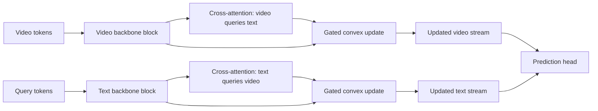

# Stable Cross-Modal Interaction

An executable reference implementation for **“A Regularized Backbone-Level Cross-Modal Interaction Framework for Stable Temporal Reasoning in Video-Language Models”** (Mathematics 2026, 14, 996).

[Paper](https://doi.org/10.3390/math14060996) · [Interactive demo](#run-the-web-demo) · [Reproduction guide](docs/REPRODUCTION.md)

This repository turns the paper's central idea into code: a learnable gate constrains bidirectional video-language interaction inside the transformer backbone. The core implementation follows Equation (4):

$$
\widetilde{h}^{(l)}_V = (1-\gamma^{(l)})h^{(l)}_V + \gamma^{(l)}A(h^{(l)}_V, h^{(l)}_Q),
\qquad \gamma^{(l)}=\sigma(\alpha^{(l)})\in[0,1].
$$

> **Reproducibility scope.** The local paper artifact did not include the authors' original training code, checkpoints, or datasets. This repository faithfully reimplements the published operator and exposes the paper-reported tables. It does **not** claim that the full benchmark was independently rerun. Locally computed smoke-test results are labeled separately from paper-reported results.

## What is included

- A reusable PyTorch implementation of the gated cross-modal update.
- Bidirectional video-to-text and text-to-video interaction.
- Diagnostics for the Bounded Update Property, gate values, update norms, and attention entropy.
- A deterministic smoke benchmark over multiple random seeds.
- Paper-reported results in machine-readable CSV form plus a derived comparison script.
- A FastAPI service and responsive research-demo interface.
- Tests, Docker support, and GitHub Actions CI.

## Architecture



The gate is initialized to `0.1`, matching the paper. Each update remains on the line segment between its unimodal feature and cross-modal candidate, so:

$$
\|\widetilde{h}_V-h_V\| \leq \gamma\|A(h_V,h_Q)-h_V\|.
$$

## Paper-reported comparison

These values are transcribed from Tables 2, 5, and 6 of the paper.

| Dataset | Model | Clean accuracy | 50% frame-drop accuracy | Drop | Macro-F1 |
|---|---:|---:|---:|---:|---:|
| EgoTaskQA | DE-0 | 27.0% | — | 3.93 pp | — |
| EgoTaskQA | FIB-6 (Gated) | **31.7%** | — | **0.94 pp** | — |
| MSR-VTT (Binary) | DE-0 | 51.0% | 51.0% | 0.0 pp¹ | 0.334 |
| MSR-VTT (Binary) | FIB-6 (Gated) | **64.0%** | **62.5%** | 1.5 pp | **0.539** |

¹ The paper identifies the DE-0 result as *trivial stability* caused by majority-class behavior, rather than robust reasoning.

Key deltas:

- EgoTaskQA clean accuracy: **+4.7 percentage points**.
- EgoTaskQA frame-drop degradation: **2.99 points smaller** (76.1% reduction).
- MSR-VTT clean accuracy: **+13.0 percentage points**.
- MSR-VTT Macro-F1: **+0.205**.
- MSR-VTT gated model retention after 50% frame drop: **97.7%**.
- Compute trade-off: +5.9% parameters, +11.6% GFLOPs, and approximately +20% latency.

See [`results/paper_reported_results.csv`](results/paper_reported_results.csv) for provenance and [`results/derived_summary.json`](results/derived_summary.json) for computed deltas.

## Quick start

```bash
python -m venv .venv
# Windows
.venv\Scripts\activate
# macOS / Linux
source .venv/bin/activate

python -m pip install -e ".[dev]"
pytest -q
python scripts/run_smoke_benchmark.py
```

The smoke benchmark verifies the bounded update across five random seeds and writes `results/smoke_benchmark.csv`.

## Minimal model example

```python
import torch
from rcmi import BidirectionalGatedFusion

video = torch.randn(2, 16, 128)
query = torch.randn(2, 12, 128)

fusion = BidirectionalGatedFusion(
    hidden_dim=128,
    num_heads=8,
    gate_init=0.1,
)

fused_video, fused_query, diagnostics = fusion(video, query)
print(diagnostics["video"].gamma.item())
print(diagnostics["video"].max_bound_violation)
```

## Run the web demo

```bash
python -m uvicorn app.main:app --host 127.0.0.1 --port 8000 --reload
```

Open [http://127.0.0.1:8000](http://127.0.0.1:8000). The page provides:

- an interactive gate-bound calculator;
- the paper-reported benchmark comparison;
- a live embedding-level fusion endpoint;
- explicit labeling of reported versus locally computed evidence.

API documentation is available at [http://127.0.0.1:8000/docs](http://127.0.0.1:8000/docs).

### Docker

```bash
docker build -t stable-cross-modal .
docker run --rm -p 8000:8000 stable-cross-modal
```

## Repository layout

```text
.
├── app/                    # FastAPI service and static research demo
├── docs/                   # Full-benchmark integration notes
├── results/                # Reported and locally computed results
├── scripts/                # Reproducible diagnostics and result summaries
├── src/rcmi/               # PyTorch implementation
└── tests/                  # Model, diagnostics, and API tests
```

## Full benchmark reproduction

The published experiments require EgoTaskQA/MSR-VTT data, EgoVLPv2 weights, and the paper's exact training configuration. The upstream [EgoVLPv2 repository](https://github.com/facebookresearch/EgoVLPv2) is archived but publicly readable. Follow [`docs/REPRODUCTION.md`](docs/REPRODUCTION.md) to connect this module to that backbone without mixing paper-reported and independently reproduced numbers.

## Citation

```bibtex
@article{kim2026regularized,
  title={A Regularized Backbone-Level Cross-Modal Interaction Framework for Stable Temporal Reasoning in Video-Language Models},
  author={Kim, Geon-Woo and Jung, Ho-Young},
  journal={Mathematics},
  volume={14},
  number={6},
  pages={996},
  year={2026},
  doi={10.3390/math14060996}
}
```

